UNIVERSIDADE DO ESTADO DE SANTA CATARINA — UDESC

CENTRO DE CIÊNCIAS TECNOLÓGICAS — CCT

BACHARELADO EM CIÊNCIA DA COMPUTAÇÃO — BCC

**IGOR FROEHNER**

# Tradução da Forma SSA Gerada pela LLVM para Código Funcional

Joinville

2024

## Folha de Aprovação

**IGOR FROEHNER**

**TRADUÇÃO DA FORMA SSA GERADA PELA LLVM PARA CÓDIGO FUNCIONAL**

**BANCA EXAMINADORA**

**Orientador:**
Dr. Cristiano Damiani Vasconcellos — UDESC

**Coorientador:**
Me. Paulo Henrique Torrens — University of Kent

**Membros:**
Me. Gabriela Moreira — UDESC

Dra. Karina Girardi Roggia — UDESC

Joinville, Novembro de 2024

## Resumo

Durante o processo de tradução de código em uma linguagem fonte para
código de máquina, compiladores usam diversas representações
intermediárias (IRs - *Intermediate Representations*) para auxiliar na
análise e tradução do código [@dragao]. A forma de atribuição única
estática (SSA - *Static Single-Assignment*) é uma forma de representação
intermediária que facilita e torna mais eficientes diversos algoritmos
de otimização de código, principalmente quanto ao fluxo de dados dos
programas, e é utilizada por diversas ferramentas como GCC e LLVM
[@muchnick1997advanced]. A LLVM (*Low Level Virtual Machine*) fundamenta
a definição de sua representação intermediária (LLVM-IR) na forma SSA. [@appel1998ssa] demonstrou que há uma correspondência entre a forma de atribuição única
estática e o paradigma de programação funcional, trazendo um algoritmo
que faz a tradução estaticamente entre ambas. De maneira mais formal, [@ssaToAnf] definem um algoritmo que faz a tradução estaticamente entre SSA e uma
representação intermediária que por sua vez é utilizada em compiladores
de linguagens funcionais, ANF (*Administrative Normal Form*). A partir
dos fatos que SSA e programação funcional na forma ANF são equivalentes,
e que a LLVM fundamenta sua representação funcional em SSA, o presente
trabalho buscou explorar a possibilidade de tradução da LLVM-IR para
código puramente funcional em Haskell na forma ANF. Para isto foi
necessário definir um subconjunto da LLVM-IR, implementar um *parser* e
um tradutor. No subconjunto traduzido não são permitidos efeitos
colaterais, ou seja, as funções traduzidas devem ser puras, e o *parser*
somente aceita tipos inteiros simples (sem arrays, ponteiros, ou tipos
compostos). O tradutor desenvolvido dá como saída código em Haskell em
ANF que é compilável no GHC.

**Palavras-chave**: Compiladores, Representações Intermediárias,
Programação Funcional, SSA, ANF.

## Abstract

Through the process of translating code from a source language
to machine code, compilers use a variety of Intermediate Representations
(IRs) to assist the code analysis and translation [@dragao]. The Static
Single-Assignment (SSA) is a intermediate representation that makes more
efficient some code optimization algorithms, especially those related to
the program's data flow, being used by several tools like GCC and LLVM
[@muchnick1997advanced]. The LLVM (Low Level Virtual Machine) framework
grounds its intermediate representation (LLVM-IR) in the SSA form.
[@appel1998ssa] showed that the Static Single-Assignment is equivalent
to the functional programming paradigm and introduced an algorithm for
translating between the two. More formally, [@ssaToAnf] defined a algorithm that
translates statically the SSA form to another IR, which is used by
functional programming languages' compilers, the ANF (Administrative
Normal Form). Given the equivalence between Static Single-Assignment
(SSA) and the functional paradigm in ANF, and considering the LLVM's use
of SSA form as its intermediate representation, this work investigates
the potential for translating LLVM-IR into functional code in ANF. To
achieve this, a subset of LLVM-IR was defined, and then a parser and the
translator were developed. In this LLVM-IR subset, side effects are
restricted, ensuring that the translated functions are pure.
Additionally, the types are limited to simple integers, excluding
arrays, pointers, or composite types. With a valid input, the developed
translator produces executable Haskell code as its output.

**Keywords**: Compilers, Intermediate Representation, Functional
Programming, SSA, ANF.

# Introdução

A área de compiladores tem evoluído e enfrentado desafios contínuos, com
novas arquiteturas e tecnologias sendo utilizadas para executar
programas cada vez maiores e mais complexos. Além disso, há uma
emergente quantidade de linguagens de programação sendo criadas, e cada
nova linguagem necessita de sua própria ferramenta de compilação. A
complexidade envolvida na construção de tais ferramentas tem direcionado
seu *design* cada vez mais para modelos modulares e reutilizáveis
[@muchnick1997advanced]. Uma divisão frequentemente vista na construção
de compiladores é entre o *frontend* e o *backend*. O *frontend* é
responsável por fazer o tratamento dos detalhes específicos da linguagem
fonte, enquanto no *backend* são tratados os detalhes da arquitetura
alvo em específico [@dragao]. Essa tendência em modelos modulares
evidência a importância na interface desses módulos, as chamadas
representações intermediárias (IRs - do inglês *Intermediate
Representations*).

Segundo [@dragao], o processo de traduzir código da linguagem fonte para
linguagem de máquina envolve o uso de diversas representações
intermediárias. Essas representações são construídas durante o processo
de compilação de um programa, funcionando tanto como estruturas que
contêm informações necessárias para análises do código, quanto como
interfaces de comunicação entre diferentes etapas na *pipeline* de
compilação. As representações intermediárias podem ser estruturas de
dados armazenados em memória durante a execução do compilador, ou também
representações textuais ou binárias escritas em arquivos. Dentre estas é
possível citar alguns exemplos comumente encontrados na literatura,
como: Árvore Sintática Abstrata, Grafo de Fluxo de Controle, Código de
Três Endereços, entre outras.

Uma das principais IRs, que é utilizada durante etapas de otimização de
fluxo de dados nos principais compiladores modernos de linguagens
imperativas, é a forma de atribuição única estática (SSA - *Single
Static-Assignment*). Essa representação é uma forma que impõe que todas
as atribuições em um procedimento devem ser feitas a somente uma
variável, limitando que uma nova variável seja criada a cada nova
atribuição, ou seja, na qual as variáveis são imutáveis. SSA também
define a notação conceitual da função $\varphi$, que é capaz de fazer a
união de diferentes definições de variáveis no grafo de fluxo de
controle. Segundo [@muchnick1997advanced], as características da forma SSA promovem a separação
entre os valores operados em um programa, dos locais nos quais estes são
armazenados, tornando possíveis versões mais eficazes de diversas
otimizações, principalmente de fluxo de controle e dados.

Dadas as vantagens supracitadas, SSA foi utilizada como base para a
criação da representação intermediária de um dos conjuntos de
ferramentas de compilação de código que está no estado da arte
atualmente, o *framework* LLVM (do inglês, Máquina Virtual de Baixo
Nível). Esse conjunto de ferramentas foi projetado e desenvolvido com a
proposta de oferecer um conjunto de ferramentas para auxiliar no
desenvolvimento de novos compiladores de forma eficiente, modular e
reutilizável [@lattner2004llvm]. Desde seu início, no ano de 2000, o uso
da LLVM vem crescendo, sendo usado em uma variada gama de projetos de
compiladores comerciais e pesquisas acadêmicas. A LLVM apresenta dois
pontos principais: a definição de sua representação intermediária de
código (LLVM-IR) que é independente da linguagem fonte, carrega
informação de tipagem, controles de fluxo de controle explícitos, e que
oferece uma ampla gama de funcionalidades, servindo como uma forma
unificada de representar o código para análise, modificação e
distribuição; e o design do compilador, que, através de seu modelo
modular, utiliza a representação intermediária para fornecer uma vasta
combinação de capacidades de compilação e otimização de código
arbitrário [@lattner2004llvm]. LLVM é um projeto de código fonte aberto
e que contém licenças não restritivas[^1], fato que contribui com sua
popularidade, evolução e uso por parte da comunidade de desenvolvimento
de software.

O paradigma funcional recebe essa denominação porque se baseia em
programas compostos inteiramente por funções [@hughes1989functional]. A
programação e computação feita neste paradigma é feita por meio da
definição, aplicação e retorno de funções. Funções que apenas recebem
argumentos e dão um retorno, sem mais efeitos além disso. Ou seja, em
linguagens puramente funcionais não existem os chamados efeitos
colaterais, que são as alterações de estados de memória de forma que
essas alterações possam influenciar em uma computação futura. A ausência
de efeitos colaterais é garantida pela imutabilidade das variáveis. E
confere, dessa forma, a chamada transparência referencial, ou pureza,
que tem influência profunda em como os programas são construídos e
entendidos, o que leva a uma maior garantia de correção do código
[@whymattered]. A programação através do paradigma funcional tem seus
pontos fortes vastamente defendidos na literatura, por exemplo, na área
da programação paralela e distribuída. A ausência de efeitos colaterais
no paradigma funcional favorece a programação paralela pois, sem efeitos
colaterais, problemas clássicos da programação paralela, como condição
de corrida, são evitados [@hammond2011parallel] [@whymattered].

Todavia, há efeitos colaterais que são necessários ao programar
computadores. Exemplos clássicos são: a impressão na saída padrão,
escrita em arquivos, inserções em banco de dados, entre outros; que
linguagens puramente funcionais devem suportar. Portanto, as linguagens
puramente funcionais implementam meios de simular os efeitos colaterais
de forma pura: classicamente através de mônadas [@peyton1993imperative],
e mais recentemente por meio do uso de efeitos algébricos
[@leijen2016algebraic].

Compiladores de linguagens funcionais também fazem uso de diversas
representações intermediárias durante o processo de compilação. Uma
representação muito importante em etapas de otimização e análise de
código funcional é a ANF, ou Forma Administrativa Normal
(*Adminstrative-Normal Form*) [@sabry1992reasoning]. Semelhante ao SSA,
ANF tem sua importância ao deixar explícito o fluxo de controle no
código e, segundo [@ssaToAnf], tem inclusive vantagens quanto à análise do fluxo de
controle quando comparado com SSA. A ANF é fundamentalmente uma
restrição a termos lambda, ou seja, é expresso dentro do paradigma de
programação funcional.

No que tange este trabalho, [@appel1998ssa] demonstrou a correspondência entre o
paradigma funcional e a forma de atribuição única estática. Nota-se que
essa correspondência pode advir do fato de que ambas não permitem
atribuição a variáveis uma vez iniciadas. Além disso, [@ssaToAnf] demonstram que há
um algoritmo que estaticamente faz a tradução da forma SSA para ANF.
[@rigon2020inferring] exploram a correspondência entre SSA e o paradigma funcional para para
inferir efeitos algébricos em uma representação funcional gerada a
partir de SSA. Portanto, usando do fato da LLVM ter sua representação
intermediária baseada na forma SSA há a possibilidade de explorar a
tradução da LLVM-IR para o paradigma funcional em ANF.

## Objetivo Geral

O objetivo do presente trabalho é investigar a possibilidade de traduzir
a representação intermediária SSA gerada pela LLVM para representação
funcional em ANF, tendo como objetivo futuro o uso dessa representação
em uma extensão do método proposto por [@rigon2020inferring] para inferir efeitos algébricos
em código imperativo real.

## Objetivos Específicos

- Estudar os conceitos de compiladores de tradução de código,
  representação intermediária, SSA e o paradigma de programação
  funcional;

- Estudar sobre a tradução de código intermediário (SSA) da LLVM para
  código puramente funcional;

- Implementar um tradutor de código SSA gerado pela LLVM para código
  puramente funcional;

- Elucidar a possibilidade de fazer tal tradução e quais são as
  ressalvas quanto a essa abordagem.

## Estrutura do Trabalho

O presente trabalho é estruturado em mais 3 capítulos: no Capítulo
[2](#cap:fundamentacao), são explorados em profundidade os
principais conceitos teóricos necessários para a proposta e
implementação deste trabalho; o Capítulo
[3](#cap:desenvolvimento) detalha a proposta, explica a
implementação do método, apresenta os resultados e faz uma breve
discussão; por fim, no Capítulo [4](#cap:conclusao), é feita a conclusão sobre o resultado obtido
neste trabalho.

# Fundamentação Teórica
Neste capítulo serão aprofundados os principais fundamentos que formam a
base teórica na qual foi firmado o presente trabalho, dentre estes:
representações intermediárias de código, forma de atribuição única
estática, ANF e o *framework* LLVM.

## Representações Intermediárias de Código

A compilação de um programa é feita por meio de diversas etapas, entre
as quais são necessárias representações que permitam a comunicação, ou
que facilitem certos processamentos, como otimizações, análises e a
geração de código. Segundo [@dragao], ao traduzir um programa da linguagem fonte
para código de máquina de uma arquitetura específica, o compilador cria
uma série de representações intermediárias (IRs).

Existem diversos modelos de IRs de código, cada um com suas aplicações
específicas em diferentes etapas do processo de compilação. Por exemplo,
as árvores sintáticas abstratas são usualmente construídas durante a
análise sintática de um programa, e podem ser utilizadas também durante
a geração do código de saída. Grafos de Fluxo de Controle (CFG -
*Control Flow Graph*) são usados em fases analíticas e auxiliam, por
exemplo, na identificação de código inatingível nos programas, nesse
caso possibilitando otimizações do artefato final a ser gerado.

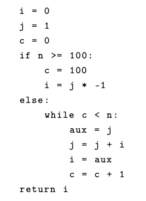

*Fonte: O autor*

*Se n >  = 100 retorna -1, senão retorna o n-ésimo número de Fibonacci*

Na Figura [2.2](#fig:cfg-example1) é apresentado um exemplo de representação
intermediária na forma de um Grafo de Fluxo de Controle referente ao
código que calcula o número de Fibonacci presente da Figura
[2.1](#fig:ex-codigo).
Nessa IR o código é representado por um grafo no qual cada nó contém um
bloco de expressões sequenciais e novos nós e arestas são adicionados
quando existem condicionais ou *gotos* (vá para), expressando os
diferentes caminhos possíveis de execução por meio de um grafo. Nessa
representação intermediária os caminhos de execução no fluxos de
controle do programa são evidenciados.

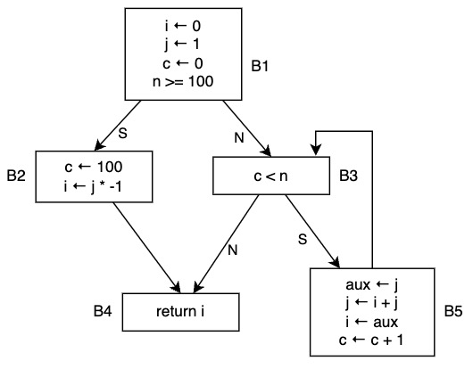

*Fonte: O autor*

*Exemplo de Grafo de IR em Fluxo de Controle da Figura 2.1*

Ao demonstrar os usos das IRs durante o processo de tradução de código,
[@dragao] classifica-as em duas categorias, de acordo com seu uso ao longo da
transformação do código fonte para código de máquina:

- **Representações Intermediárias de Alto Nível**: Estão mais próximas
  da linguagem fonte e são utilizadas nas primeiras etapas da tradução
  do código. Exemplos incluem as árvores sintáticas abstratas, que
  descrevem a estrutura direta do código fonte e são úteis em tarefas
  como a checagem estática de tipos.

- **Representações Intermediárias de Baixo Nível**: Aproximam-se mais da
  máquina alvo e aparecem em etapas posteriores da tradução do código
  fonte. Focam em tarefas específicas da máquina alvo, como alocação de
  registradores e seleção de instruções.

Além dos usos já citados, com o advento das novas propostas de projeto
de compiladores modulares e reutilizáveis, as IRs têm desempenhado um
papel importante ao permitir a comunicação do *frontend*, que é
encarregado de fazer a leitura e tratamentos do código fonte, com o
*backend* que, por sua vez, faz otimizações, análises e pode gerar como
saída o código de máquina para a arquitetura alvo. Nesse caso de uso a
IR serve como uma linguagem para a comunicação entre as interfaces dos
diferentes componentes do compilador [@lattner2004llvm].

A Figura [2.3](#fig:llvm-ri-ex1) apresenta um exemplo de IR especificada e
usada pela LLVM, código que imprime no terminal a frase \"Hello
World!\". Neste exemplo é possível observar que a representação
intermediária gerada contém, além das definições e expressões
necessárias, algum metadado que possivelmente será útil para as etapas
seguintes da compilação. Na Seção
[2.4.1](#sec:llvm-ir) a
LLVM-IR será detalhada com mais profundidade.

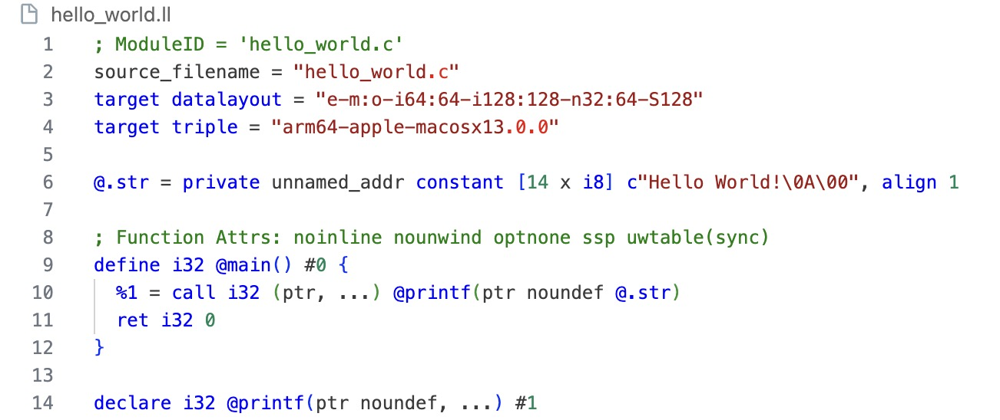

*Fonte: O autor, gerado através do clang*

*Exemplo de IR em LLVM-IR*

Ademais, é importante pontuar que, como visto nos exemplos, IRs podem
ser tanto estruturas de dados armazenadas durante a execução do
compilador, quanto uma linguagem em si, e seu uso vai depender de como o
compilador foi projetado [@dragao]. Há inclusive a possibilidade de usar
uma linguagem de programação como IR, por exemplo C, que compila para
código nativo eficiente.

## Forma de Atribuição Única Estática

É vastamente referenciado na literatura que a forma de atribuição única
estática (SSA - *Static Single-Assignment*) é de importante valor ao
facilitar certas otimizações de código para linguagens imperativas
[@appel1998ssa] [@dragao] [@muchnick1997advanced]. Sendo assim,
utilizada de maneira ampla na implementação das etapas de otimização de
código de compiladores e ferramentas de otimização de código, como é o
caso da LLVM e do GCC (GNU Compiler Collection).

Mais especificamente, [@muchnick1997advanced] traz alguns exemplos de algoritmos de otimização
que SSA facilita e torna mais eficazes, principalmente referentes à
análise do fluxo de dados de programas, como: propagação de constantes,
numeração de valores, movimentação e remoção código invariante e remoção
de redundância parcial. Segundo [@muchnick1997advanced], isso segue do fato que na forma SSA há
a separação dos valores contidos no programa, com base no lugar em que
estes são usados.

Um procedimento está em forma de atribuição única estática quando cada
variável que recebe um valor dentro dele é alvo de apenas uma atribuição
[@muchnick1997advanced]. Ao passo que a cada atribuição uma nova
variável deve ser criada, e dessa forma, as variáveis são imutáveis.
Além disso, é definida a notação conceitual da função $\varphi$, usada
para unir definições de variáveis em caminhos divergentes no fluxo de
controle, selecionando aquela pela qual o fluxo de controle passou
durante a execução [@dragao]. Nota-se que a atribuição de uma variável
pode ocorrer dentro de um laço de repetição, o que levaria a múltiplas
definições desta, e iria contrariar as restrições da forma SSA. No
entanto, a forma de atribuição única em SSA é uma característica
estática do programa, e não uma propriedade dinâmica da execução
[@appel1998ssa]. A Figura
[2.6](#fig:not-ssa-vs-ssa) contém um exemplo de código e sua
representação e ao lado sua representação em forma SSA, demonstrando a
criação de novas variáveis a cada atribuição feita.

*Não SSA*

*Em forma SSA*

*Fonte: O autor, adaptado de [@dragao]*

*Comparação entre atribuições em não SSA e em SSA*

O mecanismo padrão de tradução para a forma SSA é adicionar uma
subscrição a cada variável toda vez que há uma atribuição, vide Figura
[2.6](#fig:not-ssa-vs-ssa), onde $p$ é dividido em $p_1$, $p_2$ e
$p_3$ e $q$ se torna as duas variáveis $q_1$ e $q_2$. Porém, quando há
mais de um caminho de execução em que uma mesma variável pode ser
definida, há a necessidade de uma forma de unir estas. E é nesse momento
que se faz o uso da função $\varphi$, que tem a capacidade unir as
definições divergentes de uma mesma variável nos pontos de junção do
fluxo de controle.

A Figura [2.7](#fig:cfg-ssa-ex) contém um exemplo de como o programa da
Figura [2.2](#fig:cfg-example1) fica na forma SSA. Nota-se o uso da função
$\varphi$ no ponto de junção para a variável $i$, o valor de $i_2$
naquele nó será atribuído ao valor do qual o fluxo de execução chega
naquele bloco, podendo ter sido definida em B1 (onde é iniciado em 0) ou
em B5 (recebendo o valor de aux$_1$).

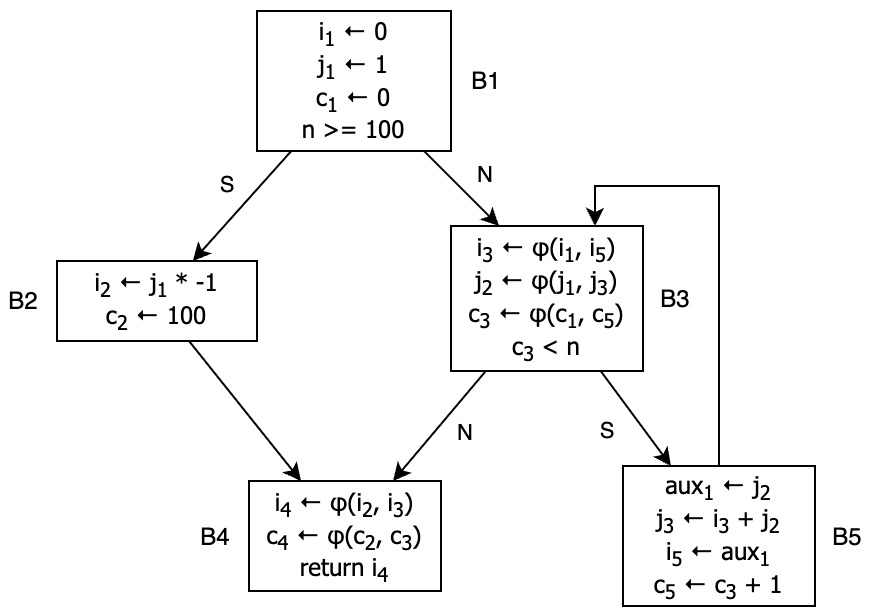

*Fonte: O autor*

*CFG da Figura 2.2 em forma SSA*

Há ainda o conceito de forma SSA mínima, que é a forma SSA que usa o
menor número de funções $\varphi$ possível. Para traduzir um código para
a forma SSA mínima usa-se o conceito de fronteira de dominância
(Definição [2.5](#def:dominance-frontier)) [@cytron1991efficiently].

É importante mencionar o uso de SSA na LLVM, um caso que demonstra a
utilidade prática aplicada ao conjunto de ferramentas de compilação que
está no estado da arte atualmente. Segundo [@lattner2004llvm], a LLVM usa SSA como sua
representação de código primária (exceto para definições de locação de
memória), em que cada registrador virtual é escrito à exatamente uma
instrução, e cada uso de registrador é dominado (Definição
[2.1](#def:domination))
pela sua definição. [@lattner2004llvm] defendem o uso da forma SSA dizendo que esta oferece
uma representação simplificada do fluxo de dados, facilitando muitas
otimizações e possibilitando que algoritmos mais rápidos que não
dependem do fluxo (*flow-insensitive*) tirem proveito das vantagens de
algoritmos que são sensíveis ao fluxo (*flow-sensitive*), sem o custo de
análises complexas no fluxo de dados. Adicionalmente, as mudanças que
não envolvem *loops* nessa estrutura são mais simples, já que não se
deparam com dependências contrárias ou de saída em suas variáveis
[@lattner2004llvm].

### Árvore de Dominância
Conceitos advindos da teoria dos grafos como: dominância, fronteira de
dominância, dominância imediata e árvore de dominância, são essenciais
para este trabalho e são utilizados inclusive no método de tradução
descrito no Capítulo [3](#cap:desenvolvimento).

**Definição 2.1** (Dominação). Na teoria de grafos, mais especificamente
em grafos de fluxo, um nó $d$ é dito dominar um nó $n$ se, a partir do
nó inicial, todos os caminhos até $n$ devem passar pelo nó $d$
[@muchnick1997advanced]. Notacionalmente $d \
dom \ n$. Nota-se que, por definição, todos os nós dominam si mesmos.

**Definição 2.2** (Dominação Estrita). Em um grafo de fluxo, um nó $d$
domina estritamente um nó $n$ se $d$ domina $n$ e $d \neq n$.
Notacionalmente $d \ sdom \ n$.

**Definição 2.3** (Predecessor e Predecessor Imediato). Em um grafo de
fluxo, um nó $n$ é predecessor de $m$ ($n \ pred \ m$) se existe pelo
menos um caminho da origem até $m$ que passa por $n$; $n$ é considerado
predecessor imediato ($Pred$) se em algum caminho é utilizada uma aresta
de $m$ para $n$.

**Definição 2.4** (Dominância Imediata). O dominador imediato de um nó
$n$ é o único nó que, domina estritamente $n$, mas não domina nenhum
outro nó que domina estritamente $n$. Observa-se que todos os nós em um
grafo de fluxo tem um dominador imediato, com exceção do inicial.

**Definição 2.5** (Fronteira de Dominância). Sendo $x$ um nó do grafo de
fluxo de controle, a fronteira de dominância de $x$ é o conjunto de
todos os nós $y$ no grafo de fluxo tal que $x$ domina um predecessor
imediato de $y$, mas não domina estritamente $y$
[@cytron1991efficiently].

Esses conceitos são principalmente utilizados ao analisar a dominância e
dependência dos blocos dentro do grafo de fluxo de controle. Percebe-se
que, se um bloco do grafo de fluxo de controle $n$ é dominado por outro
nó $d$, as variáveis do bloco $d$ existem e podem ser acessadas no bloco
$n$. Com isso, a estrutura de árvore de dominância favorece essa análise
ao fornecer informação sobre o escopo das variáveis de um procedimento.

**Definição 2.6** (Árvore de Dominância). A árvore de dominância de um
dado grafo de fluxo é a árvore em que os filhos de cada nó $n_i$ são os
nós dominados imediatamente por $n_i$. A raiz da árvore é o nó inicial.

A Figura [2.10](#fig:dominance-ex) contém um exemplo de árvore de dominância
lado a lado ao grafo de fluxo de controle do código de exemplo da Figura
[2.2](#fig:cfg-example1). Percebe-se que o nó B4 é dominado somente
pelo bloco B1 uma vez que há caminhos da origem até B4 que passam por B2
ou B3.

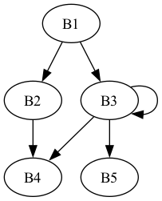

*Grafo de fluxo de controle*

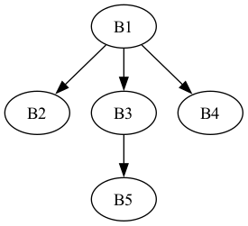

*Árvore de dominância*

*Fonte: O autor*

*Comparação entre CFG e Árvore de Dominância do Código da Figura 2.2*

## ANF

A Forma A-normal (ANF) é um conceito importante na compilação de
programas funcionais, sendo utilizado frequentemente para simplificar a
estrutura dos programas e facilitar otimizações. [@sabry1992reasoning] introduziram ANF como
uma alternativa mais simples ao estilo de passagem de continuações (CPS,
do inglês *Continuation Passing Style*), demonstrando sua efetividade em
transformações e otimizações de código funcional.

Fundamentalmente, ANF é uma restrição a termos do cálculo-$\lambda$, na
qual é imposto que os termos lambda sejam escritos em estilo direto
[@ssaToAnf]. Em suma, isso quer dizer que os argumentos em aplicações de
expressões devem ser termos atômicos (variáveis ou constantes). E que,
para haver continuações na computação, são usadas variáveis temporárias
atribuídas às sub-expressões do procedimento, e que são definidas em
expressões *let*. A Figura
[3.2](#fig:llvm-ir-gramatica) apresenta um exemplo de gramática
livre de contexto na qual não há como aninhar aplicações de expressões,
sendo necessário que uma aplicação seja atribuída a uma variável antes
de ser utilizada, ou seja, uma gramática na qual as produções são na
forma ANF. Na notação utilizada, as classes gramaticais indicadas por
uma linha superior (*overline*) representam sequências de zero ou mais
ocorrências dessas produções gramaticais. Pontua-se que ANF é definido
conforme o cálculo-$\lambda$ com avaliação *call-by-value* definido por
[@plotkin1975call].

*Fonte: O autor*

*Gramática Exemplo de ANF*

Em ANF o grafo de fluxo de controle é explícito, uma vez que chamadas de
cauda são claramente distinguidas por sua posição dentro das expressões
*let*: chamadas de função no lado direito de uma atribuição de variável
indicam chamadas normais, enquanto aquelas que aparecem no corpo
significam chamadas de cauda, ou *jumps* no fluxo de controle
[@ssaToAnf]. Essa representação explícita de chamadas e chamadas de
cauda simplifica análises sobre a execução do programa e facilita as
otimizações nesse sentido. A Figura
[2.14](#fig:lambda-vs-anf) apresenta um exemplo de como uma
expressão fica quando escrita em ANF.

Semelhante à forma SSA, ANF codifica explicitamente o fluxo de dados ao
nomear todas as sub-expressões dentro do programa e ao permitir apenas
uma definição para cada variável [@ssaToAnf]. No entanto, ANF impõe essa
restrição dinamicamente, pois um novo escopo é criado em tempo de
execução para cada invocação de função. O escopo sintático claro em ANF
facilita muitas otimizações que envolvem movimento de código entre
blocos, o que pode ser mais complexo em SSA devido à necessidade de
manter a propriedade de dominância entre a definição e uso das variáveis
[@ssaToAnf].

```haskell
h (f (g x + 1)) (k (y * 2))
```

*Não ANF*

```haskell
let a = g x in
let b = a + 1 in
let c = y * 2 in
let d = k c in
let e = f b in
h e d
```

*Em ANF*

*Fonte: O autor*

*Comparação de uma expressão em ANF*

Dadas suas vantagens e aplicabilidade no paradigma funcional, variantes
de ANF são usadas na prática como representação intermediária de
diversos compiladores de linguagens funcionais, como GHC de Haskell
[@jones1998transformation], e TIL de ML [@wegman1991constant]. Ao usar
ANF, estas ferramentas acrescentam algumas características como:
permitir tuplas, funções com mais de um argumento, operações primitivas
e condicionais. Na Seção
[3.2](#sec:desenvolvimento-anf) é apresentada a gramática livre de
contexto variante de ANF desenvolvida neste trabalho, e que é a saída do
método de tradução desenvolvido.

### Tradução entre SSA e ANF

Devido às características em comum de, por exemplo, não permitir mais de
uma atribuição a uma mesma variável e ter o fluxo de controle explícito,
pode-se inferir que existe uma relação entre a forma SSA e programação
funcional. Mais do que isto, [@kelsey1995correspondence] e [@appel1998ssa] demonstraram que ambas são
correspondentes, existindo um algoritmo que faz a tradução estática
entre elas.

De maneira mais formal, [@ssaToAnf] definem um procedimento para a tradução de SSA
para ANF, e demonstram que uma otimização, que é geralmente feita
através de SSA, também pode ser feita utilizando ANF. O procedimento de
[@ssaToAnf] servirá como base para a implementação deste trabalho apresentada no
Capítulo [3](#cap:desenvolvimento). Fazer a tradução de SSA para ANF
envolve a construção da árvore de dominância (vista na Seção
[2.2.1](#sub:arvore-dominancia)) sobre o grafo de fluxo de controle
da forma SSA. A árvore serve como base para a construção dos escopos das
funções em ANF. No código em ANF as funções correspondem tanto ao
programa completo, quanto a estrutura do grafo de fluxo de controle de
um procedimento específico [@ssaToAnf]. Os parâmetros das funções são
determinados pelos $\varphi$s do bloco de SSA, e o *jumps* são
traduzidos para chamadas de cauda.

```haskell
fib n =
  let b1 () =
        let i1 = 0
            j1 = 1
            c1 = 0
            b2 () =
              let c2 = 100
                  i2 = j1 * (-1)
              in b4 i2 c2
            b3 i3 j2 c3 =
              let b5 () =
                    let aux1 = j2
                        j3 = i3 + j2
                        i5 = aux1
                        c5 = c3 + 1
                    in b3 i5 j3 c5
              in if c3 < n then b5 ()
                           else b4 i3 c3
            b4 i4 c4 = let in i4
        in if n >= 100 then b2 ()
                       else b3 i1 j1 c1
    in b1 ()
```

*Fonte: O autor*

*Programa funcional em ANF em Haskell referente ao CFG da Figura 2.7*

A Figura [2.15](#fig:eq-ssa-func) contém um exemplo de código em ANF
referente ao SSA da Figura [2.7](#fig:cfg-ssa-ex). Nessa sintaxe, o ANF desse código é
executável no GHC. Observa-se nesse exemplo que cada bloco é traduzido
para uma função. Dentro do escopo dos blocos estão também as funções
referentes aos blocos imediatamente dominados por estes. Os $\varphi$s
do bloco determinam seus argumentos, e para determinar o valor dos
argumentos nas chamadas de função é necessário buscar o valor que seria
atribuído pelo $\varphi$ a partir do bloco que está fazendo a chamada.

No que se refere a este trabalho, [@rigon2020inferring] exploraram tal correspondência ao
propor a definição do núcleo de uma linguagem puramente funcional, e a
implementação de um algoritmo de inferência de tipos para código
funcional que é gerado a partir de sua representação em forma SSA.

## LLVM

O *framework* LLVM (do inglês Máquina Virtual de Baixo Nível) foi
projetado e desenvolvido com a proposta de oferecer um conjunto de
ferramentas para análise e transformação de código arbitrário
[@lattner2004llvm]. Este *framework* vem se consolidando desde sua
criação, e tornou-se uma parte fundamental no design de diversos
compiladores modernos, sendo adotado por grandes empresas de tecnologia
como Apple com o *clang*, Google na plataforma Android e Mozilla com
Rust. Isso se deve principalmente devido à sua capacidade de otimização
de código, suporte a várias linguagens de programação e designs de
hardware, e arquitetura modular que favorece o acoplamento de seus
módulos em outros sistemas.

Segundo [@lattner2004llvm], a LLVM tem dois principais pontos que a diferenciam das demais
soluções, e que serão melhor explorados nessa seção: o projeto do
compilador e a representação intermediária utilizada no *framework*.
Segundo [@lattner2004llvm], o compilador é construído num modelo modular que é capaz de
explorar a LLVM-IR como interface desses módulos, dessa forma fornecendo
uma vasta combinação de capacidades quanto à otimização e tradução de
código.

A Figura [2.16](#fig:llvm-design) apresenta uma visão de alto nível da
arquitetura do sistema da LLVM e é explicada pelos autores como segue:

> Resumidamente, compiladores *frontend* estáticos emitem código na
> representação da LLVM, que será então combinado pelo LLVM linker. O
> linker faz uma série de otimizações em *link-time*, especialmente as
> inter-procedurais. O código LLVM resultante é traduzido para código
> nativo para uma dada arquitetura alvo em *link-time* ou *install-time*,
> e o código LLVM é então salvo em código nativo (é possível traduzir o
> código LLVM em tempo de execução, com um tradutor *just-in-time*). O
> gerador de código nativo insere uma instrumentação leve para identificar
> partes do código frequentemente executadas e que podem ser otimizadas em
> tempo de execução. Os dados de perfil coletados em tempo de execução
> representam as execuções do usuário final (não do desenvolvedor) e podem
> ser usados por um otimizador *offline* para realizar otimizações
> agressivas diretamente orientadas por perfil durante o tempo ocioso,
> adaptadas à máquina alvo específica. [@lattner2004llvm]

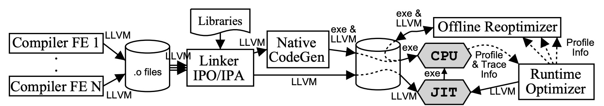

*Fonte: O autor*

*Diagrama da arquitetura do sistema da LLVM*

[@lattner2004llvm] também argumentam que a arquitetura projetada para a LLVM provê estas
cinco capacidades que, em conjunto, a diferencia das demais soluções:
(1) modelo de compilação contínua, (2) geração de código *offline*, (3)
perfilagem (*profilling*) e otimizações baseadas no usuário, (4) modelo
de *runtime* transparente, e (5) compilação uniforme de todo o programa.

Conforme anteriormente citado, a parte que fundamenta e integra todos os
módulos e funcionalidades da LLVM é a sua representação intermediária, a
LLVM-IR, que será melhor detalhada na próxima seção.

### LLVM-IR
A representação intermediária de código definida pela LLVM (fundamentada
no modelo SSA), traz algumas funcionalidades inovadoras, e serve como
uma forma unificada de representar código para fins de análise,
modificação e distribuição durante todo o processo de transformação de
código [@lattner2004llvm]. A especificação de tal representação consiste
em um conjunto de instruções similares a de um processador do tipo RISC
(do inglês, *Reduced Instruction Set Computer*), mas com informações de
alto nível importantes para análises eficazes do código a ser gerado.
[@lattner2004llvm] colocam três principais aspectos:

1.  Um sistema de tipos de baixo nível que pode ser usado para
    implementar tipos de dados e operações das linguagens de alto nível,
    expondo os comportamentos implementados a todas as etapas de
    otimização. Este sistema de tipos inclui informações de tipo que
    poderão ser usadas por técnicas sofisticadas (independentes de
    linguagem), como algoritmos para análise de ponteiros, análise de
    dependências e transformações de dados.

2.  Instruções para fazer conversão dos tipos e aritmética de endereços
    de baixo nível, preservando a informação de tipagem.

3.  Duas instruções para tratamento de exceções em baixo nível para
    implementação de semânticas de exceção específicas das linguagens,
    mantendo explícito o fluxo de controle ao compilador.

Quanto à estrutura do código, na representação intermediária da LLVM o
fluxo de controle fica explícito, uma vez que \"uma função é um conjunto
de blocos básicos, e cada bloco básico é uma sequência de instruções
LLVM, terminando em exatamente uma instrução terminadora \[\...\]. Cada
terminador especifica explicitamente seus blocos básicos sucessores.\"
[@lattner2004llvm].

Segundo a referência da linguagem, o conjunto de instruções da LLVM-IR
conta atualmente com mais de 60 códigos de operação (*opcodes*). Dentre
estas estão instruções de operações matemáticas, operações em ponteiros,
operadores de comparação, instruções de terminação (*return*, *branch*),
e também operações mais específicas da solução da LLVM, como conversão
entre tipos com diversas opções. O sistema de tipos da LLVM permite a
sobrecarga dos operadores para mais de um tipo, ou seja, a instrução
*add* por exemplo pode ser usada tanto para inteiros de qualquer
tamanho, quanto para ponto flutuantes [@llvmLangRef].

Uma funcionalidade importante do sistema da LLVM, apesar de não visada
diretamente nesse trabalho, é o sistema de tipos da LLVM-IR, que conta
com diversos tipos nativos, uma robusta instrumentação para definição de
tipos compostos, e que é independente da linguagem fonte. Na LLVM todas
as variáveis e objetos na memória da representação SSA têm um tipo
associado, e todas as operações devem se submeter a regras de tipo
específicas [@lattner2004llvm]. O sistema de tipos compreende tipos
como: *void*, booleano, inteiros com ou sem sinal de 8 até 64 bits e
ponto flutuante de precisão simples ou dupla. Além disso, a LLVM contém
somente 4 tipos derivados: ponteiros, arrays, estruturas e funções
[@llvmLangRef].

A seguir há um código em LLVM-IR gerado utilizando o compilador *clang*
a partir de um código em C++. O clang foi utilizado pois a ferramenta de
linha de comando tem uma opção para emitir código em LLVM-IR. A versão
do *clang* utilizada foi a 15.0.0 em um notebook com processador *Apple
M1 Pro*. O comando exato para emitir esse código foi:
`clang -emit-llvm -S -O1 fact.cpp`, as flags `-emit-llvm -S` servem para
que o *clang* dê como saída código em LLVM-IR e a flag `-O1` foi
utilizada por dar a saída já com algumas otimizações e já em forma SSA.

```llvm
; ModuleID = 'myfib.c'
source_filename = "myfib.c"
target datalayout = "e-m:o-i64:64-i128:128-n32:64-S128"
target triple = "arm64-apple-macosx14.0.0"

; Function Attrs: nofree norecurse nosync nounwind readnone ssp uwtable(sync)
define i32 @fib(i32 noundef %0) local_unnamed_addr #0 {
  %2 = icmp sgt i32 %0, 99
  br i1 %2, label %12, label %3

3:                                                ; preds = %1
  %4 = icmp sgt i32 %0, 0
  br i1 %4, label %5, label %12

5:                                                ; preds = %3, %5
  %6 = phi i32 [ %8, %5 ], [ 0, %3 ]
  %7 = phi i32 [ %10, %5 ], [ 0, %3 ]
  %8 = phi i32 [ %9, %5 ], [ 1, %3 ]
  %9 = add nsw i32 %6, %8
  %10 = add nuw nsw i32 %7, 1
  %11 = icmp eq i32 %10, %0
  br i1 %11, label %12, label %5, !llvm.loop !6

12:                                               ; preds = %5, %3, %1
  %13 = phi i32 [ -1, %1 ], [ 0, %3 ], [ %8, %5 ]
  ret i32 %13
}

attributes #0 = { nofree norecurse nosync nounwind readnone } ; ...

!llvm.module.flags = !{!0, !1, !2, !3, !4}
!llvm.ident = !{!5}

!0 = !{i32 2, !"SDK Version", [2 x i32] [i32 14, i32 4]}
!1 = !{i32 1, !"wchar_size", i32 4}
; ... continua com mais metadados
```

*Fonte: O autor, gerado usando clang e editado*

*Exemplo de Código em LLVM-IR*

Trazendo uma visão geral sobre o código da Figura
[2.17](#fig:exemplo-llvm-ir): no começo do código há metadados
quanto ao arquivo de origem e à arquitetura alvo; linhas iniciadas em
\";\" são comentários; na definição da função, além dos tipos que são
obrigatórios, há algumas *flags* para otimização; dentro dos colchetes
estão os blocos da forma SSA, o primeiro bloco não necessita
explicitamente de um *label*, mas recebe implicitamente o próximo
registrador do SSA disponível (nesse caso o \"%1\", já que o argumento
usa o \"%0\"). Também é interessante notar as operações `phi` e `br`
(*branch*) e seus argumentos e que todas as operações e instruções
carregam tipagem explícita.

A LLVM-IR ser fundamentada na forma SSA quer dizer que cada registrador
virtual (variável) é definido exatamente uma vez e o uso de um
registrador deve ser dominado por sua definição [@lattner2004llvm]; e a
LLVM-IR conta com a instrução `phi` explícita, que corresponde
diretamente à função $\varphi$ da forma SSA [@lattner2004llvm].

# Desenvolvimento
Como referenciado, a correspondência entre SSA e programação funcional
já foi explorada por vários trabalhos que buscaram entender como extrair
valor deste fato. Notoriamente, [@rigon2020inferring] exploram esta correspondência ao propor
o núcleo de uma linguagem pseudo-imperativa com sistema de tipo e
efeitos baseados no trabalho de [@leijen2014koka] usando a forma SSA traduzida do código
em Koka.

O presente trabalho implementa uma proposta de extensão do trabalho de [@rigon2020inferring],
agora traduzindo código genérico para programação funcional (em ANF), a
partir da representação intermediária da LLVM. Levando a possibilidade
de, no futuro, ser pesquisada a inferência de efeitos em código em
LLVM-IR, consequentemente código gerado a partir de linguagens
imperativas.

Uma das propostas de valor deste trabalho é apresentada na Figura
[3.1](#fig:proposta),
demonstrando a possibilidade de tradução de código arbitrário para
código funcional. A partir de código em alguma linguagem fonte como C,
C++ ou Rust, a LLVM é utilizada para gerar a LLVM-IR em forma SSA. A
representação intermediária gerada é então usada como entrada para o
método proposto nesse trabalho, que faz a tradução da representação
intermediária da LLVM para código funcional em forma ANF na linguagem
Haskell. Porém, essa é ainda uma exploração inicial dessa tradução, já
que nesse trabalho é interpretado somente um subconjunto da
representação intermediária da LLVM.

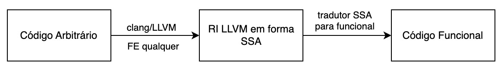

*Fonte: O autor*

*Diagrama da Proposta do Sistema de Tradução*

O método de tradução proposto neste trabalho foi implementado em duas
fases: inicialmente criando um *parser* (analisador sintático) para um
subconjunto da representação intermediária da LLVM, e então
desenvolvendo uma adaptação do método descrito por [@ssaToAnf] para traduzir a
LLVM-IR em forma SSA para uma representação intermediária similar à ANF
que é apresentada como código em linguagem Haskell. O objetivo da
geração do código na sintaxe de Haskell é facilitar a validação do
trabalho, uma vez que dessa forma programas que não apresentam efeitos
colaterais poderão ser executados.

## *Parser* da LLVM-IR

A primeira etapa para a tradução é a implementação de um *parser* da
LLVM-IR para que, com base no código interpretado, a tradução seja
aplicada. Deste modo, a gramática usada para a interpretação foi
desenvolvida com base em exemplos gerados usando o *clang* em código
C++, e com base na documentação de referência da linguagem que é
fornecida pela LLVM[^2].

Visto que a LLVM-IR conta com diversas funcionalidades de alto e baixo
nível, no código podem ser geradas diversas informações como: metadados,
informação para depuração, *flags* de otimização, etc [@llvmLangRef].
Entre estas, há muitas operações, palavras reservadas e funções nativas
que não são úteis ou fogem do escopo deste trabalho. Devido a isso e ao
tempo disponível para desenvolvimento, um subconjunto da linguagem
intermediária foi selecionado. Nesse subconjunto o escopo global só
permite definição de funções, sem variáveis ou demais dados globais.
Ademais, para simplificar o escopo deste trabalho, constantes foram
limitadas somente a numerais de tipos inteiros de qualquer tamanho.

*Fonte: O autor*

*Gramática de interpretação da LLVM-IR*

Conforme a gramática presente na Figura
[3.2](#fig:llvm-ir-gramatica), os procedimentos em LLVM-IR tratados
nesse trabalho são na seguinte forma: a definição de uma função se dá
pelo seu tipo, nome, os seus parâmetros, e os blocos da forma SSA. Os
blocos são definidos por seu *label* e devem conter, nessa ordem, uma
sequência de $\varphi$s, em seguida as declarações de variáveis, e por
último um *jump* no fluxo de controle (por exemplo, retorno ou
*branch*). É determinado que todos os blocos e argumentos precisam ter
um *label*, ou seja, precisam ser nomeados. Nesta gramática o não
terminal $o$ representa as operações nativas da LLVM, nas quais estão
compreendidas operações matemáticas, de comparação, conversão, entre
outras. Essas operações nativas foram mapeadas e traduzidas para
operações correspondentes em linguagem Haskell, para que o código gerado
possa ser executado. Na Seção
[3.3](#cap:desenvolvimento-traducao) há mais detalhes sobre como
essas operações foram traduzidas. Observa-se também que na LLVM-IR não
há necessidade de um terminador de linha como \";\"  ou até mesmo uma
nova linha para a próxima instrução. Devido a isso, a gramática não
contém nenhum terminal pontuando o fim de uma linha.

A Figura [3.3](#fig:exemplo-entrada) apresenta um exemplo de código bem
formatado que é gerado pela gramática definida. Neste exemplo foram
removidas *flags* de otimização, informação para depuração e outras
informações que são ignoradas durante a análise léxica. Nota-se que os
tipos fazem parte da estrutura do código na linguagem de entrada.
Posteriormente esses tipos são desconsiderados ao gerar a representação
ANF em código. Ao final desta etapa obtêm-se uma representação em
memória do SSA interpretado, com toda a informação necessária para fazer
a tradução descrita na Seção
[3.3](#cap:desenvolvimento-traducao).

```llvm
define i32 @factorial(i32 %0) {
1:
  br label %2

2:
  %3 = phi i32 [ 1, %1 ], [ %8, %6 ]
  %4 = phi i32 [ %0, %1 ], [ %7, %6 ]
  %5 = icmp slt i32 %4, 2
  br i1 %5, label %9, label %6

6:
  %7 = add nsw i32 %4, -1
  %8 = mul nsw i32 %3, %4
  br label %2

9:
  %10 = mul nsw i32 %3, 1
  ret i32 %10
}
```

*Fonte: O autor*

*Exemplo de Código de Entrada Válido*

## ANF Gerado
A gramática ANF descrita nesta seção busca esclarecer e facilitar as
notações e entendimento do leitor. Todavia, é necessário destacar que o
código de saída do método desenvolvido é em Haskell e será melhor
abordado no final da Seção
[3.3](#cap:desenvolvimento-traducao).

Recapitulando sobre ANF, pode-se frasear as suas restrições em:
argumentos de funções devem ser valores atômicos (constantes ou
variáveis), e resultados de aplicações devem ser imediatamente
capturados por uma variável dentro de um *let*. A gramática definida
como saída visa garantir que estas restrições sejam diretamente
atingidas somente pelo fato do programa pertencer às produções da
gramática livre de contexto.

A forma ANF definida na gramática da Figura
[3.4](#fig:gramatica-saida) é uma variante da ANF original, na qual
foram adicionadas algumas funcionalidades, por exemplo: as funções podem
ter mais de um argumento, há operações primitivas (operações matemáticas
e bit a bit) e condicionais. As produções sobre o não terminal $o$ são
as traduções das operações nativas da LLVM para sintaxe do Haskell que,
para efeitos desse trabalho, puramente retornam o valor resultante da
operação. A tradução dessas operações é melhor descrita na seção
seguinte, e suas produções podem ser vistas na coluna da direita da
Tabela
[\[tab:traducao-operacoes\]](#tab:traducao-operacoes).

*Fonte: O autor*

*Gramática do ANF Gerado como Saída*

Sobre $f$, está a produção da função em ANF que irá corresponder a
função a ser traduzida da forma SSA, que fundamentalmente contém a
definição da função traduzida do bloco inicial e a chamada para esse
bloco inicial. As produções sobre o não terminal $j$ são as chamadas de
cauda das funções em ANF, chamadas podem ser para um valor (retorna o
valor), outra função, ou uma condicional. A condicional é traduzida
diretamente para $v \ \ \mathbf{\neq 
\ 0}$ para ser uma tradução mais direta da instrução de `br` da LLVM-IR.

## Processo de tradução
O procedimento de tradução desenvolvido foi uma adaptação da tradução
descrita por [@ssaToAnf]. O código em LLVM-IR na forma SSA é interpretado e
utilizado como entrada para $\mathcal{F}$ (Figura
[3.8](#fig:traducao)),
dando como saída o código em ANF seguindo a gramática livre de contexto
da Tabela
[\[tab:traducao-operacoes\]](#tab:traducao-operacoes).

Ao fazer a tradução de SSA para ANF, inicialmente há de ser tratada de
uma diferença fundamental entre SSA e ANF quanto à explicitude do escopo
das variáveis no código. Em ANF o escopo é explícito na estrutura do
código, ou seja, se uma variável existe em uma função, ela existe em
todas as funções que são aninhadas nessa função, e não existe antes ou
depois da definição da função. Em SSA, blocos que vêm antes no código,
podem usar variáveis que ainda não foram definidas, contanto que em
tempo de execução aquela variável exista e a definição da variável
domine seus usos. Em outras palavras, em SSA o escopo é determinado pelo
grafo de fluxo de controle, que não é explícito na estrutura do código e
sim implícito nos seus *jumps*. Por isso, para que a tradução entre
ambos seja feita, é utilizado o conceito de árvores de dominância
(Definição [2.6](#def:dom-tree)), que é calculada sobre o grafo de fluxo de
controle da forma SSA. A Figura
[3.7](#fig:graph-vs-dom-factorial) contém um exemplo do CFG e da
árvore de dominância do código da Figura
[3.3](#fig:exemplo-entrada).

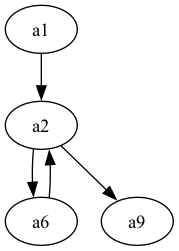

*Grafo de fluxo de controle*

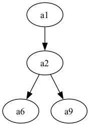

*Árvore de dominância*

*Fonte: O autor*

*CFG e Árvore de Dominância do Código da Figura 3.3*

A Figura [3.8](#fig:traducao) apresenta o método de tradução desenvolvido.
Sobre a notação utilizada, de mesma forma que as produções gramaticais
anotadas com *overline*, funções anotadas com *overline* querem dizer
que aquela função é aplicada ponto a ponto.

A tradução começa por $\mathcal{F}$, que recebe toda a função em SSA e
irá retornar a função em ANF, os argumentos são os mesmos da função em
SSA. Em termos, a função traduzida contém a tradução do primeiro bloco e
a chamada para a função traduzida desse primeiro bloco. Por isso, após
em $\mathcal{F}$, $\mathcal{F}_b$ é chamada e faz a tradução do bloco
inicial, a qual estarão aninhadas, direta ou indiretamente, todas as
demais funções, uma vez que o bloco inicial domina todos os demais. A
chamada de cauda da função inicial é a chamada de cauda para função
correspondente ao bloco inicial e é o ponto inicial da execução.

A tradução dos blocos em $\mathcal{F}_b$, de mesma forma, é feita
retornando uma função em ANF. Os argumentos são determinados pelos
$\varphi$s do bloco em SSA ($\mathcal{F}_\varphi$). Um argumento é
gerado para cada $\varphi$, e o nome deste argumento é o nome da
variável ao qual o resultado da instrução `phi` é atribuído. Após os
$\varphi$s, o bloco em SSA contém uma lista de definições de variáveis,
as quais são traduzidas em $\mathcal{F}_s$. No escopo do bloco sendo
traduzido são aninhadas as funções referentes aos blocos dominados
imediatamente por este, por isto chama-se recursivamente $\mathcal{F}_b$
para os blocos filhos do bloco sendo traduzido. Toda função em ANF terá
uma chamada de cauda, e as chamadas em ANF são traduzidas a partir do
*jump* da forma SSA. Se o *jump* da LLVM-IR é o retorno de um valor,
esse valor é retornado na função; se esse *jump* é um *branch* sem
condicional para outro bloco, a função traduzida referente a este outro
bloco é chamada; se há um *branch* condicional na forma SSA, esse
*branch* é traduzido para uma condicional na forma ANF.

*Fonte: O autor*

*Procedimento de Tradução*

Em $\mathcal{F}_j$, os argumentos para as chamadas de cauda das funções
traduzidas são buscados nos $\varphi$s do bloco destino com base no
*label* do bloco origem. Por exemplo, se o bloco de *label* $a$ tem um
*jump* para o bloco de *label* $b$, e $\overline{\varphi}_b$ é o
conjunto de $\varphi$s de $b$. Então, para cada $\varphi_b$ é buscado o
argumento $\textbf{[} \ v \ \textbf{,} \ \ l \ \textbf{]}$ onde $l = b$,
retornando que o valor do argumento daquela variável na chamada de cauda
será $v$.

A Tabela
[\[tab:traducao-operacoes\]](#tab:traducao-operacoes) apresenta o mapeamento das operações
nativas da LLVM para expressões equivalentes em Haskell. Tal mapeamento
foi feito com base no funcionamento de cada operação, consultando a
referência da linguagem da LLVM[^3]. Primeiramente, nota-se que existem
operações da LLVM que se distinguem quanto ao tipo do operando, como:
`sdiv` e `udiv`, divisão com sinal (*signed*) e sem sinal (*unsigned*).
Essa diferenciação não existe em Haskell, uma vez que foi utilizado
somente o tipo Int, portanto esses casos foram mapeados para uma mesma
expressão. Além disso, a LLVM possui operações de conversão entre tipos,
em Haskell não há a necessidade dessa conversão. As operações bit a bit,
como `and`, `or`, `xor`, não são definidas no Prelude de Haskell,
portanto foi necessário sempre adicionar uma importação a biblioteca
`Data.Bits` no começo dos arquivos Haskell.

Dado um programa bem formatado em SSA, $\mathcal{F}$ retorna um programa
bem formatado em ANF. Isso é garantido, uma vez que todas as funções
presentes na Figura [3.8](#fig:traducao) recebem uma produção de uma classe gramatical
de entrada, e retornam uma produção de uma das classes gramaticais de
saída.

*Fonte: O autor, saída do tradutor desenvolvido*

*ANF de Saída de ℱ a partir do Código da Figura 3.3*

Um exemplo de resultado desta tradução para o código da Figura
[3.3](#fig:exemplo-entrada) pode ser visto na Figura
[3.9](#fig:exemplo-saida). Neste exemplo o código segue exatamente
a gramática aqui descrita, porém, conforme comentado, essa notação é
diferente, mas diretamente correspondente a como a saída do tradutor é
dada. Na prática o código resultante da tradução implementada é código
Haskell compilável no GHC. A Figura
[3.10](#fig:exemplo-saida-haskell) apresenta um exemplo de como é o
resultado exato dado pelo tradutor para essa mesma entrada (código da
Figura [3.3](#fig:exemplo-entrada)), na qual nota-se que a diferença é
apenas quanto ao padrão da notação.

Algo importante de abordar nesse ponto é quanto ao tratamento das
variáveis, já que as regras para definição de identificadores de
variáveis da LLVM-IR não são compatíveis com as do Haskell. Como visto
nos exemplos, em LLVM-IR, as variáveis locais começam com \"`%`\" e
podem ser qualquer sequência de caracteres, inclusive começando com
números, o que não é permitido em Haskell. Portanto, para obter código
válido em Haskell, um dos tratamentos feitos foi remover o \"`%`\" no
inicio das variáveis locais substituindo por um caractere \"`a`\".

Ademais, há um detalhe quanto a expressão de ANF em Haskell, pois
conforme citado, ANF adota avaliação *call-by-value*
[@flanagan1993essence], enquanto que a avaliação em Haskell é
*call-by-need*. Portanto, para que o código gerado tenha o mesmo
comportamento sob ambas semânticas, em algumas definições é adicionado
um parâmetro unit \"()\", assim transformando tais expressões em
declarações de funções e garantido que não seriam avaliadas no momento
de sua definição mesmo em uma linguagem cuja ordem de avaliação seja
*call-by-value*. Além disso esse parâmetro é necessário para manter que
a sintaxe de ANF seja mantida e não permita expressões *let* aninhadas
[@sabry1992reasoning]. Esse é um parâmetro que não irá ser usado dentro
das funções, por isso foi escolhido o tipo *Unit* \"()\" do Haskell.

| LLVM-IR | Haskell |
|---------|---------|
| `x = add t v1, v2` | `x = v1 + v2` |
| `x = sub t v1, v2` | `x = v1 - v2` |
| `x = mul t v1, v2` | `x = v1 * v2` |
| `x = udiv t v1, v2` | `` x = v1 `div` v2 `` |
| `x = sdiv t v1, v2` | `` x = v1 `div` v2 `` |
| `x = urem t v1, v2` | `` x = v1 `mod` v2 `` |
| `x = srem t v1, v2` | `` x = v1 `mod` v2 `` |
| `x = and t v1, v2` | `x = v1 .&. v2` |
| `x = or t v1, v2` | `x = v1 .`<code>\|</code>`. v2` |
| `x = xor t v1, v2` | `` x = v1 `xor` v2 `` |
| `x = shl t v1, v2` | `` x = v1 `shiftL` v2 `` |
| `x = lshr t v1, v2` | `` x = v1 `shiftR` v2 `` |
| `x = icmp eq t v1, v2` | `x = if v1 == v2 then 1 else 0` |
| `x = icmp ne t v1, v2` | `x = if v1 /= v2 then 1 else 0` |
| `x = icmp ugt t v1, v2` | `x = if v1 > v2 then 1 else 0` |
| `x = icmp uge t v1, v2` | `x = if v1 >= v2 then 1 else 0` |
| `x = icmp ult t v1, v2` | `x = if v1 < v2 then 1 else 0` |
| `x = icmp ule t v1, v2` | `x = if v1 <= v2 then 1 else 0` |
| `x = icmp sgt t v1, v2` | `x = if v1 > v2 then 1 else 0` |
| `x = icmp sge t v1, v2` | `x = if v1 >= v2 then 1 else 0` |
| `x = icmp slt t v1, v2` | `x = if v1 < v2 then 1 else 0` |
| `x = icmp sle t v1, v2` | `x = if v1 <= v2 then 1 else 0` |
| `x = select t1 v1, t2 v2, t3 v3` | `x = if v1 == 1 then v2 else v3` |
| $x$ = $\mu$ $t_1$ $v$ to $t_2$ | `x = v` |
| $x$ = call $t_1$ $x_f$ ( $\overline{y}$ ) | $x$ = $x_f\ \overline{y}$ |

*Fonte: O autor*

```haskell
import Data.Bits

factorial a0 =
  let
    a1 () =
      let
        a2 a3 a4 =
          let
            a5 = if a4 < 2 then 1 else 0
            a6 () =
              let
                a7 = a4 + (-1)
                a8 = a3 * a4
              in a2 a8 a7
            a9 () =
              let
                a10 = a3 * 1
              in a10
          in if a5 /= 0
            then a9 ()
            else a6 ()
      in a2 1 a0
  in a1 ()
```

*Fonte: O autor, resultado dado pelo tradutor*

*Tradução Resultante para o Exemplo da Figura 3.3*

## Resultados

Nesta seção a tradução implementada é aplicada a mais exemplos, e os
resultados são extraídos e discutidos. Os exemplos apresentados são as
traduções de: um código de divisão segura, o Algoritmo de Euclides para
o calculo do Máximo Divisor Comum [@knuth2014art], e um algoritmo
*naïve* de checagem de primos. Os códigos de exemplo em LLVM-IR foram
gerados a partir de código C, usando o *clang* versão `15.0.0` em uma
máquina com processador `Apple M1 Pro`, e foi utilizado com o seguinte
comando:

    clang -S -emit-llvm -O1 -g0 <arquivo.c> -o <arquivo.ll>

Os códigos gerados foram editados com três objetivos: remover palavras
chaves que são ignoradas na análise léxica; a adição explicitamente do
*label* ao primeiro bloco, uma vez que esta não é gerada automaticamente
pelo *clang*; as funções são traduzidas com alterações em seu nome, foi
colocado novamente o nome segundo da função do código de entrada. Para
que não fuja ao escopo deste trabalho, nesses exemplos são utilizados
somente tipos inteiros simples: sem ponteiros, *arrays* ou tipos
compostos. Além dos exemplos expostos nesta seção, o repositório deste
trabalho[^4] conta com outros exemplos como: soma de inteiros até $n$,
exponenciação modular, busca binária da raiz quadrada de um inteiro, e
cálculo da função totiente de Euler.

### Divisão Segura

Nesse exemplo foi criada uma função em C++ que recebe dois inteiros, em
que $n$ é o dividendo e $d$ é o divisor, retornando -1 se $d = 0$, se
não retorna o resultado da divisão inteira de $n$ por $d$.

```c
int safe_div(int n, int d) {
    if (d == 0) return -1;
    else return n / d;
}
```

*Divisão Segura em C++*

```llvm
define i32 @safe_div(i32 %0, i32 %1) {
2:
  %3 = icmp eq i32 %1, 0
  br i1 %3, label %6, label %4

4:
  %5 = sdiv i32 %0, %1
  br label %6

6:
  %7 = phi i32 [ %5, %4 ], [ -1, %2 ]
  ret i32 %7
}
```

*Divisão Segura em LLVM-IR*

*Fonte: O autor, gerado usando clang e editado*

*Exemplo de Código Fonte de Divisão Segura*

Constata-se no código na Figura
[3.12](#fig:safe-div-llvm) e também no CFG e árvore de dominância na
Figura [3.16](#fig:graph-vs-dom-safe-div), que este é um exemplo simples
que contém somente três blocos. O primeiro bloco usa uma instrução
`icmp` para fazer a comparação do segundo argumento com $0$. A variável
`%3`, é definida com o valor $1$ se `%1` é igual (`eq`) a zero, se não
recebe $0$. A instrução `br` checa se o valor em `%3` é verdadeiro
($\neq 0$), e em caso positivo direcionando o fluxo para o bloco de
*label* `6`, em caso negativo é dirigido ao bloco de *label* `4`. No
bloco `4` a divisão com sinal é feita e a execução vai para o bloco `6`.
O bloco 6 faz o retorno do resultado, em que, pela instrução `phi`
depende de se o fluxo veio a partir do bloco `2`, ou `4`.

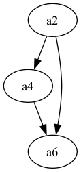

*Grafo de fluxo de controle*

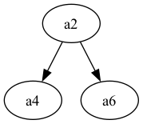

*Árvore de dominância*

*Fonte: O autor*

*CFG e Árvore de Dominância do Código de Divisão Segura*

```haskell
import Data.Bits

safe_div a0 a1 =
  let
    a2 () =
      let
        a3 = if a1 == 0 then 1 else 0
        a4 () =
          let
            a5 = a0 `div` a1
          in a6 a5
        a6 a7 =
          let
          in a7
      in if a3 /= 0
        then a6 (-1)
        else a4 ()
  in a2 ()
```

*Fonte: O autor, resultado dado pelo tradutor*

*Tradução Resultante do Exemplo de Divisão Segura*

A Figura [3.17](#fig:safe-div-saida) contém o resultado da saída do tradutor
implementado. Esse resultado é código Haskell e pode ser carregado no
GHC e executado. Nota-se que na tradução as funções são equivalentes aos
blocos da forma SSA: `a2`, `a4`, `a6`. Com as funções `a4` e `a6`
aninhadas a função `a2`, visto que o bloco de *label* `2` domina
imediatamente os outros blocos. Nota-se também que a função `a6` tem um
argumento, que corresponde a instrução `phi` atribuída a `%7`. Nas suas
chamadas de cauda, `a2` chama condicionalmente `a6` com valor $-1$, e
`a4` usa como argumento a variável `a5`.

### Algoritmo de Euclides

Sendo $u$ e $v$ inteiros não nulos, o Maior Divisor Comum (GCD, do
inglês *Greatest Common Divisor*) é o maior inteiro que divide $u$ e $v$
sem deixar resto [@knuth2014art]. No Livro 7 de \"Elementos\"  de
Euclides, um algoritmo para calcular o GCD é descrito, que veio a ser
conhecido como Algoritmo de Euclides. A Figura
[3.18](#fig:euclides-cpp) apresenta uma implementação recursiva
desse algoritmo na linguagem C, e esse código foi utilizado para gerar o
exemplo de entrada em LLVM-IR da Figura
[3.19](#fig:euclides-llvm).

Este exemplo contém quatro blocos básicos: o bloco `2` somente leva a
execução ao bloco `3`, no bloco `3` há duas instruções `phi` a
comparação e um *branch* que usa o valor da comparação, o bloco `7`
calcula o resto (`srem`) e volta para o bloco `3`, e por fim o bloco `9`
que somente faz o retorno do resultado armazenado na variável `%4`.
Neste exemplo há um um *loop* entre os blocos `a3` e `a7`, que fica
evidenciado no CFG na Figura
[3.23](#fig:graph-vs-dom-gcd), e que fica também explícito após a
tradução nas chamadas de cauda das funções.

```c
int euclides_gcd(int a, int b) {
    if (b == 0) return a;
    else return euclides_gcd(b, a % b);
}
```

*Algoritmo de Euclides em C*

```llvm
define i32 @euclides_gcd(i32 %0, i32 %1) {
2:
  br label %3

3:
  %4 = phi i32 [ %0, %2 ], [ %5, %7 ]
  %5 = phi i32 [ %1, %2 ], [ %8, %7 ]
  %6 = icmp eq i32 %5, 0
  br i1 %6, label %9, label %7

7:
  %8 = srem i32 %4, %5
  br label %3

9:
  ret i32 %4
}
```

*Algoritmo de Euclides em LLVM-IR*

*Fonte: O autor, gerado usando clang e editado*

*Algoritmo de Euclides em LLVM-IR*

Segue do exemplo do Algoritmo de Euclides a tradução apresentada na
Figura [3.24](#fig:euclides-saida), com as quatro funções que correspondem
aos quatro blocos da forma SSA. Destaca-se que a função `a9` apenas
retorna o valor recebido como argumento, assim como na forma SSA. As
instruções `phi` do bloco `3` são traduzidos para os dois parâmetros da
função `a3`, e o valor que essa variável assume é definido dependendo de
qual função está fazendo a chamada.

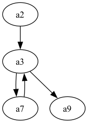

*Grafo de fluxo de controle*

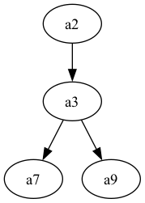

*Árvore de dominância*

*Fonte: O autor*

*CFG e Árvore de Dominância do Código do Algoritmo de Euclides*

```haskell
import Data.Bits

euclides_gcd a0 a1 =
  let
    a2 () =
      let
        a3 a4 a5 =
          let
            a6 = if a5 == 0 then 1 else 0
            a7 () =
              let
                a8 = a4 `mod` a5
              in a3 a5 a8
            a9 () =
              let
              in a4
          in if a6 /= 0
            then a9 ()
            else a7 ()
      in a3 a0 a1
  in a2 ()
```

*Fonte: O autor, resultado dado pelo tradutor*

*Tradução Resultante para o Exemplo do Algoritmo de Euclides*

### Teste de Primalidade

Para obter um exemplo maior, foi utilizado um algoritmo *naïve* de
checagem de primalidade. O código da Figura
[3.25](#fig:primo-c)
recebe um inteiro `num`, e se `num <= 1` retorna `0`, se não, faz um
laço com `i`, de dois até raiz quadrada de `num` com passo um. E dentro
da execução do laço, se `num` é divisível por `i` então `num` não é
primo. Se o laço de repetição termina sem retornar, então `num` é primo.

```c
int is_prime(int num) {
    if (num <= 1) return 0;
    for (int i = 2; i * i <= num; i++) {
        if (num % i == 0) return 0;
    }
    return 1;
}
```

*Teste de Primalidade Naïve em C*

```llvm
define i32 @is_prime(i32 %0) {
1:
  %2 = icmp slt i32 %0, 2
  br i1 %2, label %19, label %3

3:
  %4 = icmp slt i32 %0, 4
  %5 = and i32 %0, 1
  %6 = icmp eq i32 %5, 0
  %7 = or i1 %4, %6
  br i1 %7, label %16, label %8

8:
  %9 = phi i32 [ %10, %13 ], [ 2, %3 ]
  %10 = add nuw nsw i32 %9, 1
  %11 = mul nsw i32 %10, %10
  %12 = icmp sgt i32 %11, %0
  br i1 %12, label %16, label %13

13:
  %14 = srem i32 %0, %10
  %15 = icmp eq i32 %14, 0
  br i1 %15, label %16, label %8

16:
  %17 = phi i1 [ %4, %3 ], [ %12, %8 ], [ %12, %13 ]
  %18 = zext i1 %17 to i32
  br label %19

19:
  %20 = phi i32 [ 0, %1 ], [ %18, %16 ]
  ret i32 %20
}
```

*Teste de Primalidade Naïve em LLVM-IR*

*Fonte: O autor, gerado usando clang e editado*

*Exemplo de Teste de Primalidade*

O código em LLVM-IR gerado a partir desse exemplo contém seis blocos,
três dos quais `8`, `16` e `19` tem instruções `phi`. Observa-se que a
instrução `phi` atribuída a variável `17` contém três argumentos, que
acontece pelo fato de o fluxo chegar ao bloco `16` a partir de outros
três blocos e que o valor de `17` é determinado pelo bloco que levou a
execução até o `16`. Nota-se na Figura
[3.28](#fig:graph-vs-dom-prime) que esse exemplo contém um grafo de
fluxo de controle mais notável, em que a árvore de dominância desempenha
um papel importante ao apontar os escopos das variáveis e das funções
após para a tradução.

Segue da aplicação da tradução nesse exemplo o resultado visto na Figura
[3.27](#fig:primo-saida). Código que contém seis funções, e pode-se
perceber que as funções `a8`, `a16` e `a19` têm suas instruções `phi`
traduzidas para seus argumentos. Pontua-se também que a variável `%17`,
que na forma SSA é atribuída à instrução `phi` com três argumentos, e no
código traduzido há três chamadas para a função `a16`. Além disso, neste
exemplo são usados operadores bit a bit, o \"ou\"  (.\|.) e o \"e\"
 (.&.), que são definidos na biblioteca `Data.Bits`.

Para comentar mais como a árvore de dominância é utilizada para definir
o escopo das funções, pela Figura
[3.28](#fig:graph-vs-dom-prime), observa-se que o bloco `a8` domina
imediatamente somente o bloco `a13`. Fazendo com que a função traduzida
`a13` exista somente dentro do escopo da função `a8`.

```haskell
import Data.Bits

is_prime a0 =
  let
    a1 () =
      let
        a2 = if a0 < 2 then 1 else 0
        a3 () =
          let
            a4 = if a0 < 4 then 1 else 0
            a5 = a0 .&. 1
            a6 = if a5 == 0 then 1 else 0
            a7 = a4 .|. a6
            a8 a9 =
              let
                a10 = a9 + 1
                a11 = a10 * a10
                a12 = if a11 > a0 then 1 else 0
                a13 () =
                  let
                    a14 = a0 `mod` a10
                    a15 = if a14 == 0 then 1 else 0
                  in if a15 /= 0
                    then a16 a12
                    else a8 a10
              in if a12 /= 0
                then a16 a12
                else a13 ()
            a16 a17 =
              let
                a18 = a17
              in a19 a18
          in if a7 /= 0
            then a16 a4
            else a8 2
        a19 a20 =
          let
          in a20
      in if a2 /= 0
        then a19 0
        else a3 ()
  in a1 ()
```

*Fonte: O autor*

*Tradução Resultante do Exemplo de Teste de Primalidade*

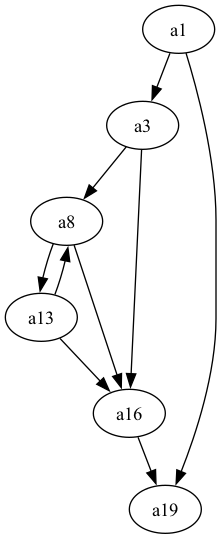

*Grafo de fluxo de controle*

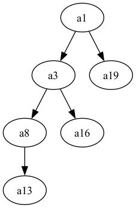

*Árvore de dominância*

*Fonte: O autor*

*CFG e Árvore de Dominância do Código de Teste de Primalidade*

## Discussão

Nessa seção será feita uma discussão sobre o que se mostrou possível
traduzir através do método proposto. De início é possível comentar que a
LLVM é um conjunto de ferramentas de tradução de código capaz de
compilar projetos grandes com diversos arquivos, funções e bibliotecas.
Porém nesse trabalho são traduzidas somente funções puras em um arquivo,
permitindo também somente a chamada para outras funções puras. Além
disso, como foi citado, a LLVM-IR conta com diversos tipos nativos e
instrumentação robusta para definição de tipos compostos, enquanto que
neste trabalho foram tratados somente de tipos inteiros simples.

Em termos: o método implementado nesse trabalho é capaz de traduzir
funções puras que usam somente tipos inteiros simples de LLVM-IR para
código Haskell em ANF. O fato de apenas funções puras serem traduzidas
quer dizer que não foram tratados efeitos colaterais. Por exemplo: não
são permitidas variáveis globais mutáveis, são compreendidos somente
tipos inteiros simples (restringindo o uso de ponteiros de memória), não
foi mapeada nenhuma chamada de sistema operacional, entre outras
funcionalidades que fariam o uso de efeitos colaterais.

Desde a interpretação do código de entrada em LLVM-IR, por meio da
definição da gramática livre de contexto, é garantida uma parte da
pureza das funções. Isso se dá pois a gramática de entrada não permite
variáveis globais, não mapeia operações que possam causar efeitos, e
todas as instruções nativas da LLVM interpretadas são puras (sem mais
efeitos além de receberem valores e retornarem um valor). Porém é
importante pontuar que a imutabilidade das variáveis não é checada
durante a tradução, mas para que o método possa traduzir corretamente,
uma entrada válida em LLVM-IR é exigida.

Para estender a tradução e adicionar o tratamento de efeitos colaterais,
pode ser estudado o uso da metalinguagem monádica apresentada por [@moggi1988computational]. Essa
tese se fundamenta no fato de que, apesar de que [@sabry1992reasoning] estavam interessados em
descobrir como aplicar otimizações tradicionais sem utilizar CPS quando
introduziram o ANF, eles também demonstram que o cálculo obtido é
equivalente ao cálculo-$\lambda$ computacional descrito por [@moggi1991notions]. Dada essa
relação, e sabendo que, dessa forma, o cálculo usado pelo ANF é capaz de
representar quaisquer efeitos computacionais, é possível estudar a
definição de uma tradução sintática para a metalinguagem monádica de [@moggi1988computational], o
que permitiria a execução do código contendo efeitos colaterais dentro
do GHC/Haskell.

# Conclusão
Há diversos desafios e problemas a serem superados na área de
compiladores. As representações intermediárias têm um papel importante
ao permitir algoritmos de otimizações de código eficientes. Uma vez que
compiladores têm se voltado cada vez mais para modelos modulares, as
representações intermediárias têm sido usadas para promover a integração
entre os módulos dos compiladores e a eficiência dos algoritmos de
otimização.

A forma SSA favorece diversas otimizações de código quanto ao fluxo de
dados e de controle em compiladores de linguagens imperativas. Isso
segue dos fatos que SSA tem uma representação em grafo de fluxo de
controle, limita que cada variável seja definida somente uma vez e
define a notação conceitual da função $\varphi$, de forma que o fluxo de
dados fica explícito aos algoritmos de otimização. Tendo sua evidência
quanto à otimização de programas, SSA é usada para fundamentar a
representação intermediária da LLVM, a LLVM-IR.

A LLVM é o *framework* de compilação de código que está no estado da
arte atualmente. É utilizada no *clang* para as linguagens C e C++, na
construção do compilador do Rust, e encontra aplicações na compilação ou
interpretação de linguagens como Java, Python, Ruby, TypeScript, entre
outras. A LLVM se destaca por oferecer um *backend* de compilação
robusto, oferecendo uma ampla gama de otimizações com uma interface que
é ao mesmo tempo acessível e transparente, facilitando o desenvolvimento
e a implementação de novos compiladores.

Tendo em vista o fatos de que SSA é correspondente a programação
funcional [@kelsey1995correspondence] e ANF [@ssaToAnf], e que a LLVM
fundamenta sua representação intermediária em SSA, esse trabalho buscou
explorar a tradução entre código em LLVM-IR na forma SSA, para ANF em
Haskell. Para isso, foi definido um subconjunto da LLVM-IR, e foi
desenvolvida uma tradução adaptada do método descrito por [@ssaToAnf].

A partir da pesquisa feita, foi possível estabelecer uma tradução de
funções puras com tipos inteiros simples da LLVM-IR para representação
funcional em ANF na linguagem Haskell. Portanto, a principal ressalva
levantada nesse trabalho é que o tratamento de efeitos colaterais nessa
tradução necessita do desenvolvimento de uma extensão do método
proposto.

A implementação do método de tradução proposto foi feita na linguagem
Haskell, foram utilizadas bibliotecas como Alex[^5] para análise léxica,
Happy[^6] para análise sintática e FGL[^7] (*Functional Graph Library*)
para grafos. No programa desenvolvido há opções para gerar
representações gráficas do grafo de fluxo de controle e da árvore de
dominância, o que pode facilitar o entendimento da saída das traduções.
O código implementado está disponível em um repositório aberto no
GitHub[^8].

## Trabalhos Futuros

Há algumas oportunidades de pesquisas que podem ser exploradas em
trabalhos futuros com base no resultado obtido. Um caminho inicial seria
aumentar a gama de tipos nativos e instruções da LLVM que são aceitos na
interpretação, mas ainda mantendo a característica de tradução limitada
a funções puras. O que ajudaria mais à frente a compreender se a
tradução proposta é adequada para um subconjunto maior da LLVM-IR, ou
como esse método precisaria ser estendido.

Conforme comentado durante a explicação da proposta do trabalho,
[@rigon2020inferring] exploraram a correspondência entre SSA e ANF e puderam inferir tipos e
efeitos em uma linguagem pseudo-imperativa. Com o resultado do presente
trabalho é possível futuramente investigar a inferência de tipos e
efeitos sobre código em LLVM-IR, ou seja, código gerado a partir de
linguagens imperativas como C, C++ ou Rust. Ou ainda, quanto ao
tratamento de efeitos colaterais, há a possibilidade de estudar o
desenvolvimento de uma tradução estática para a metalinguagem monádica
de [@moggi1988computational].

Além disso, a justificativa do presente trabalho se fundamentou no fato
de que as representações intermediárias, ANF e SSA, tornam mais eficazes
alguns algoritmos de otimização de código. Outra pesquisa futura
possível seria buscar aplicar os códigos de saída deste trabalho a
algoritmos de otimização presentes na literatura e validar se benefícios
seriam atingidos.

[^1]: <https://github.com/llvm/llvm-project>

[^2]: https://llvm.org/docs/LangRef.html

[^3]: https://llvm.org/docs/LangRef.html

[^4]: https://github.com/IgorFroehner/llvm-ssa-to-functional

[^5]: https://hackage.haskell.org/package/alex

[^6]: https://hackage.haskell.org/package/happy

[^7]: https://hackage.haskell.org/package/fgl

[^8]: https://github.com/IgorFroehner/llvm-ssa-to-functional
